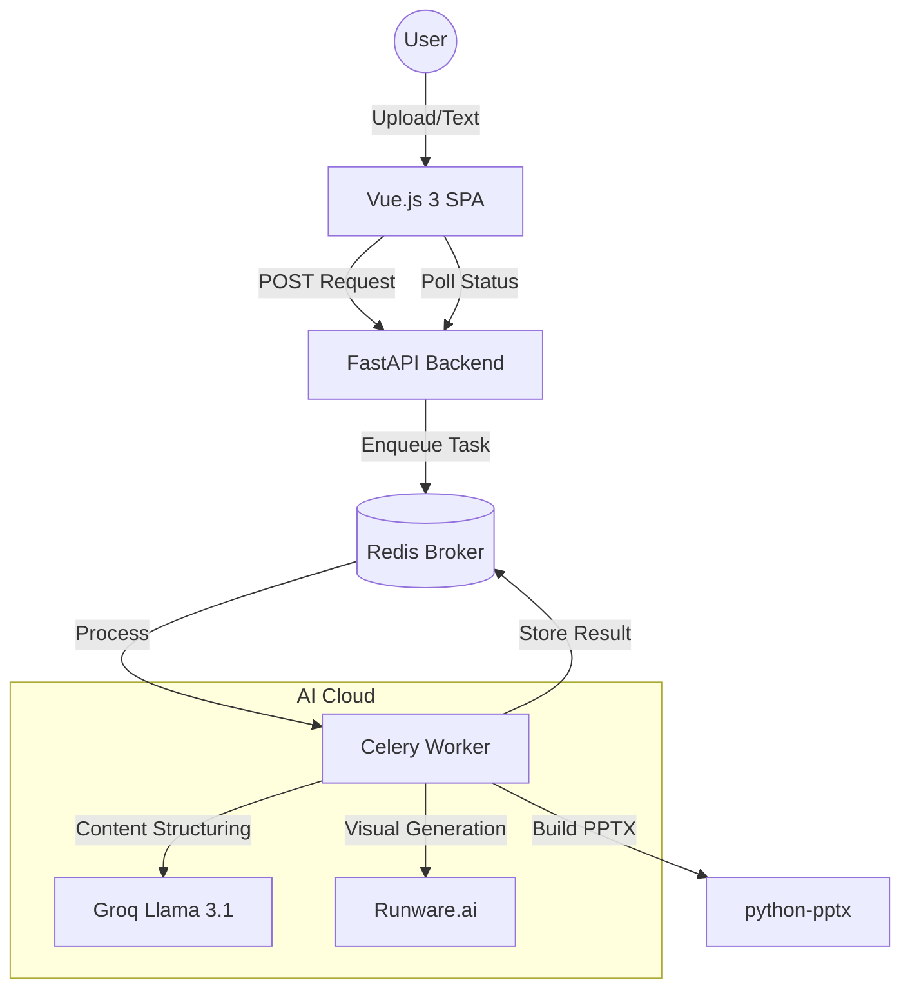

# 🎬 Cinematic AI PowerPoint Generator v4.5

A powerful, full-stack application that transforms raw text and documents into high-impact, professional PowerPoint presentations using state-of-the-art AI.

## 🌟 Key Features

- **Strict 1:1 Slide Mapping**: Every numbered point in your input becomes exactly one slide. No grouping, no skipping.
- **Pure AI Image Sourcing**: Driven by **Runware.ai (Juggernaut XL)**, the system generates bespoke, cinematic visuals for every slide.
- **Asynchronous Processing**: Powered by **Celery & Redis** to handle long-running generations (like 50-slide decks) without blocking the UI.
- **Windows-Responsive Cancellation**: Implemented a custom Redis flagging system to ensure the "Stop Generation" button works instantly, even on Windows.
- **Multi-Source Ingestion**: Support for Raw Text, PDF, DOCX, and TXT files.

---

## 🏗️ Technical Architecture

The project follows a modern distributed architecture:



---

## 🚀 How it Works (The Workflow)

### 1. Ingestion
- Users provide content via a web form or by uploading files.
- **FastAPI** extracts clean text from PDFs (via `pypdf`) or Word docs (via `python-docx`).

### 2. AI Structuring (Groq)
- The raw text is sent to the **Groq Llama 3.1** model.
- The AI identifies every numbered point and creates a structured JSON object.
- **Enforcement**: We count the points in the backend and force the AI to generate a matching number of slides.

### 3. Visual Prompting & Generation (Runware)
- For every slide, Groq generates a highly specific `visual_query`.
- The Celery worker sends this query to **Runware.ai**.
- Runware generates a cinematic, professional image (1280x704) tailored to the slide's specific context.

### 4. PowerPoint Construction
- The `python-pptx` engine builds slides on-the-fly.
- It applies dynamic layouts (alternating left/right), sets high-contrast text cards for readability, and embeds the AI-generated imagery.

---

## 🛠️ Tech Stack

### Backend
- **FastAPI**: High-performance Python web framework.
- **Celery**: Distributed task queue for background processing.
- **Redis**: In-memory database used as the task broker and cancellation flag store.
- **Groq SDK**: For lightning-fast LLM inference.
- **Runware SDK**: For high-speed AI image generation.
- **Python-pptx**: Library for creating and modifying PPTX files.

### Frontend
- **Vue.js 3**: Progressive JavaScript framework.
- **Vite**: Ultra-fast frontend build tool.
- **TailwindCSS**: For modern, reactive UI styling.
- **Axois**: For robust API communication and status polling.

---

## ⚙️ Setup & Installation

### Prerequisites
- Python 3.10+
- Node.js & npm
- Redis Server (Running locally or via Docker)

### 1. Clone & Install Backend
```bash
cd backend
python -m venv .venv
source .venv/bin/activate  # Or .venv\Scripts\activate on Windows
pip install -r requirements.txt
```

### 2. Environment Variables (`.env`)
Create a `.env` file in the `backend/` directory:
```env
GROQ_API_KEY=your_groq_key
RUNWARE_API_KEY=your_runware_key
REDIS_URL=redis://localhost:6379/0
```

### 3. Run the Services
**Start the API:**
```bash
uvicorn main:app --port 8001 --reload
```

**Start the Celery Worker (Windows):**
```bash
celery -A celery_app worker --loglevel=info --pool=solo
```

### 4. Install & Run Frontend
```bash
cd frontend
npm install
npm run dev
```

---

## 🛑 Cancellation Logic (Windows Fix)
Standard Celery `revoke` calls often fail on Windows when using the `solo` pool. Our solution uses a **Manual Redis Flag**:
1. When "Stop" is clicked, the API sets a key in Redis: `cancel_{task_id}`.
2. The Worker checks this key *before* every AI call and *after* every generation step.
3. If the key exists, the worker aborts immediately, providing a seamless user experience.

---

## 📝 License
Proprietary - Prepared for CDAC PREP / Krishnan Sir.
Developed by **Yogesh YK**.
